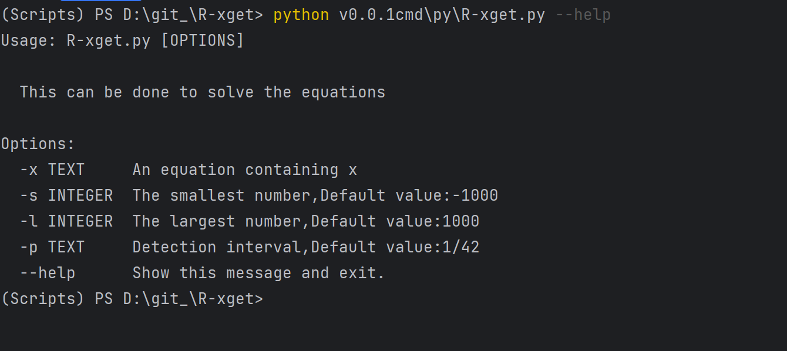
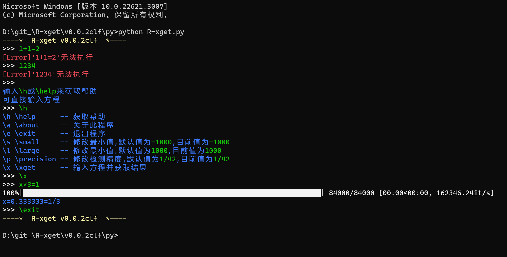

# R-xget
 就一解方程的, 练练逻辑。。。

当然, 我是初(中)生
 
安装的库:PySide2, tqdm, click

# v0.0.1cmd

在cmd输入

```输入输出
In: python R-xget.py -x x/3=1

Out: 3/1
     3.000000
```

或:



[太懒了就放个图片, 话说为什么是蓝的, 点一下?](gg.md)


# v0.0.2clf

仅仅只是使用input获取输入

print给予结果



# v0.0.16

有ui了！！！！！！！！！！！！！！！！！！！！！！！！！！！

但是废

# v0.0.17

[点击查看代码](v0.0.17\py\R-xget.py)
